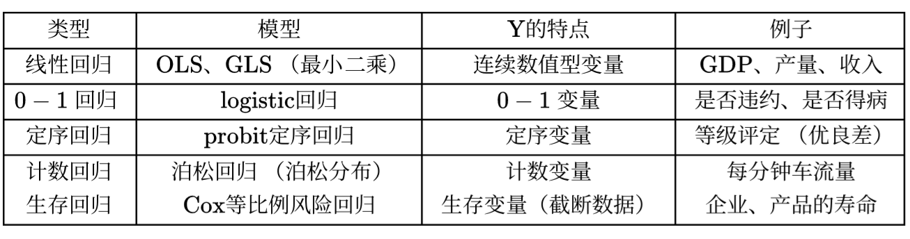

- 多属性决策问题
	- 指标正向化
		- 效益型指标：越大越好
		- 费用型指标：越小越好
		- 中间型指标：取中间值时最好
		- 区间型指标：落在某个区间最好
		- 效益性指标最常见，一般将所有指标统一为效益型，称为指标正向化
		- 费用型指标 -> 效益型指标
			- 法一：计算与最大值的差
			-
			  $$\tilde{x}_{i} = x_i\leftarrow \mathrm{max}(x) - x_i$$
			- 法二：取倒数 (不适用于有指标为 0 的情况)
			-
			  $$\tilde{x}_{i} = x_i\leftarrow \frac{1}{x_i}$$
		- 中间型指标 -> 效益型指标
		-
		  $$M=\max \left\{\left|x_{i}-x_{\text {best }}\right|\right\}$$
		-
		  $$\tilde{x}_{i} = x_i \leftarrow 1-\frac{\left|x_{i}-x_{\text {best }}\right|}{M}$$
		- 区间型指标 -> 效益型指标
		-
		  $$M=\max \left\{a-\min \left\{x_{i}\right\}, \max \left\{x_{i}\right\}-b\right\}$$
		-
		  $$
		  \tilde{x}_{i}= \begin{cases}1-\dfrac{a-x}{M} & , x<a \\ 1 & , a \leq x \leq b \\ 1-\dfrac{x-b}{M} & , x>b\end{cases}
		  $$
	- 决策矩阵标准化
		- 比例尺度变换
			- 归一化 (分配模式)
			- 最大化 (理想模式)
			- 模一化 (用于 TOPSIS)
		- 区间尺度变换
			- max-min 归一化
				- 类似比例尺度变换中的最大化，但处理后最小值一定为 0，可能造成不良后果
	- 综合方法
		- 加权和法
		- 加权积法
		- TOPSIS
	- 权重的选取
		- 客观方法
			- 熵权法
		- 主观方法
			- 相对量度 => 成对比较矩阵 (层次分析法)
			- 绝对量度
		- 综合法
-
- 数据清洗
	- 缺失值
		- 插值
			- 多项式插值
				- 对二维平面上的 $n+1$ 个互异点，存在唯一一个 $n$ 次多项式过这些点
				- 拉格朗日插值
					- 最简单
				- 牛顿插值
					- 相比拉格朗日插值，计算下一项时可以用上前一项的数据
				- 对二维平面上的 $n+1$ 个互异点，存在唯一一个 $2n+1$ 次多项式过这些点，且每点处一阶导数与给定值相同
				- 埃尔米特插值
					- 不仅要求函数值相等，还要求一阶导数值相等
				- 样条插值
					- 三次样条插值曲线和分段三次埃尔米特插值相比，精度类似，曲线更光滑
			- 分段插值
				- 由于龙格现象，高次多项式的插值效果不一定好 (区间边缘处的振荡)，因此常使用分段低次插值代替
			- 三角插值
		- 滚动平均法
	- 离群值
-
- 拟合
	- 找出给定形式的函数中使 Loss 最小的那个
	- Loss 的选取
		- MAE
		-
		  $$
		  \operatorname{argmin}_{\theta} \left(\sum_{i=1}^{n}\left|y_{i}-\hat{y}_{i}\right|\right)
		  $$
		- MSE
		-
		  $$
		  \operatorname{argmin}_{\theta}\left(\sum_{i=1}^{n}\left(y_{i}-\hat{y}_{i}\right)^{2}\right)
		  $$
		- Cross Entropy
	- 评价拟合结果
		- 总体平方和 SST
		-
		  $$
		  S S T=\sum_{i=1}^{n}\left(y_{i}-\bar{y}\right)^{2}
		  $$
		- 误差平方和 SSE
		-
		  $$
		  S S E=\sum_{i=1}^{n}\left(y_{i}-\hat{y}_{i}\right)^{2}
		  $$
		- 回归平方和 SSR
		-
		  $$
		  S S R=\sum_{i=1}^{n}\left(\hat{y}_{i}-\bar{y}\right)^{2}
		  $$
		-
		  $$
		  S S T=S S E+S S R
		  $$
		- 拟合优度 $R^2$
		-
		  $$
		  0 \leqslant R^{2}=\frac{S S R}{S S T}=\frac{S S T-S S E}{S S T}=1-\frac{S S E}{S S T} \leqslant 1
		  $$
		- 对参数线性的函数，使用拟合优度评价，越接近 1 越好
		- 否则，直接使用误差平方和 SSE 评价，越小越好
		- 对参数为线性：所有参数仅以一次方出现，且不复合
		- 如：$y=a+b^2x$、$y=a\sin (b+cx)$ 都不是对参数线性的函数
-
- 假设检验
	- 确定原假设和备择假设
		- 单侧检验 (单尾)
		- 双侧检验 (双尾)
	- 在原假设成立的情况下，构造统计量，该统计量服从一个分布，画出该分布的概率密度图
		- 分布
			- 正态分布
			- t 分布
			- F 分布
			- $\chi ^2$ 分布
	- 给一个置信水平 $\beta$ (相信原假设成立的概率)，显著性水平相应为 $\alpha = 1 - \beta$
		- 一般取 95%
	- 计算给定的置信水平下的接受域
		- 使用累积密度函数的反函数
	- 已知样本数据代入统计量得到检验值
		- 落在接受域 => 不能拒绝原假设
		- 落在拒绝域 => 小概率事件发生 => 拒绝原假设 => "...显著地..."
	- 也可使用 P 值检验，这样不计算接受域，而是计算检验值对应于概率密度函数的 P 值，再将 P 值同置信水平比较
		- \> $\beta$ => 不能拒绝原假设
		- < $\beta$ => 小概率事件发生 => 拒绝原假设
-
- 相关系数
	- 标准差
		- 总体标准差 (以 $X$ 为例)
		-
		  $$
		  \sigma_{x}=\sqrt{\frac{\sum_{i=1}^{n}\left(X_{i}-E(X)\right)^{2}}{n}}
		  $$
		- 样本标准差 (以 $X$ 为例，注意分母为 $n - 1$)
		-
		  $$
		  S_{x}=\sqrt{\frac{\sum_{i=1}^{n}\left(X_{i}-\bar{X}\right)^{2}}{n-1}}
		  $$
	- 协方差
		- 总体协方差
		-
		  $$
		  \operatorname{Cov}(X, Y)=\frac{\sum_{i=1}^{n}\left(X_{i}-E(X)\right)\left(Y_{i}-E(Y)\right)}{n}
		  $$
		- 样本协方差 (注意分母为 $n - 1$)
		-
		  $$
		  \operatorname{Cov}(X, Y)=\frac{\sum_{i=1}^{n}\left(X_{i}-\bar{X}\right)\left(Y_{i}-\bar{Y}\right)}{n-1}
		  $$
		- 协方差的大小和两个变量的量纲有关，因此不适宜用于比较
	- 皮尔逊 (Person) 相关系数
		- 实质上就是消去量纲的协方差
		- 总体皮尔逊相关系数
		-
		  $$
		  \rho_{x y}=\frac{\operatorname{Cov}(X, Y)}{\sigma_{X} \sigma_{Y}}=\frac{\sum_{i=1}^{n} \frac{\left(X_{i}-E(X)\right)}{\sigma_{x}} \frac{\left(Y_{i}-E(Y)\right)}{\sigma_{Y}}}{n}
		  $$
		- 样本皮尔逊相关系数
		-
		  $$
		  r_{X Y}=\frac{\operatorname{Cov}(X, Y)}{S_{X} S_{Y}}
		  $$
		- 注意到 $\dfrac{\left(X_{i}-E(X)\right)}{\sigma_{x}}$ 实际上就是对变量 $X$ 标准化，消去量纲
		- 皮尔逊相关系数只能度量线性相关程度 (线性相关 or 不是线性相关)，而不能处理以下几种情况：
			- 非线性相关
			- 存在离群值
		- 因此在使用前应画出散点图，确定大致线性相关，且不存在离群值
		- 显著性检验
			- 假设我们计算出了一个皮尔逊相关系数 $r$
			- 原假设：$H_0: r=0$
			- 备择假设：$H_0: r\neq 0$
			- 对于皮尔逊相关系数，在满足一定条件时，可构造统计量
			-
			  $$
			  t=r \sqrt{\frac{n-2}{1-r^{2}}}
			  $$
			- 可以证明，$t$ 服从自由度为 $n - 2$ 的 t 分布
			- 添加显著性标记
				- 不显著 (异于 0) => $r$
				- 在 90% 的置信水平上显著 (异于 0) => $r^*$
				- 在 95% 的置信水平上显著 (异于 0) => $r^{**}$
				- 在 99% 的置信水平上显著 (异于 0) => $r^{***}$
			- 假设的统计量服从 t 分布的条件
				- 数据来自正态分布的总体
				- 没有离群值
				- 样本是独立随机抽样的
	- 斯皮尔曼 (Spearman) 相关系数
		-
		  $$
		  r_{s}=1-\frac{6 \sum_{i=1}^{n} d_{i}^{2}}{n\left(n^{2}-1\right)}
		  $$
		- 其中 $d_i$ 为 $X_i$ 和 $Y_i$ 间的等级差
		- 一个数的等级，指的是将它所在列从小到大排序后，该数的位置
		- 相同数的等级都取它们位置的算术平均
		-
		  $$
		  \begin{array}{|c|c|c|c|c|c|}
		  \hline \mathbf{X} & \mathbf{Y} & level\  \mathbf{X} & level\  \mathbf{Y} & d & d^2 \\
		  \hline 3 & 5 & 2 & 1 & 1 & 1 \\
		  \hline 8 & 10 & 5 & 4.5 & 0.5 & 0.25 \\
		  \hline 4 & 8 & 3 & 3 & 0 & 0 \\
		  \hline 7 & 10 & 4 & 4.5 & -0.5 & 0.25 \\
		  \hline 2 & 6 & 1 & 2 & -1 & 1 \\
		  \hline
		  \end{array}
		  $$
		- 可以证明 $r_s \in (-1, 1)$，正表示正相关，负表示负相关，绝对值越大相关性越强
		- 可以证明，斯皮尔曼相关系数就是等级间的皮尔逊相关系数
		- 显著性检验
			- 原假设：$H_0: r_s = 0$
			- 备择假设：$H_1: r_s \neq 0$
			- 小样本 ($n \leq 30$) => 直接查表找临界值
			- 大样本 => 构造统计量 $r_{s} \sqrt{n-1} \sim N(0,1)$
	- 皮尔逊相关系数 vs 斯皮尔曼相关系数
		- 连续数据 + 正态分布 + 线性关系 => 皮尔逊相关系数
		- 上面三个条件任意一个不满足，都只能用斯皮尔曼相关系数
		- 定序数据只能用斯皮尔曼相关系数
			- 如用 1、2、3 表示优良差三个等级，这样的数据就是定序数据
		-
- 正态分布的检验
	- 雅克-贝拉 (Jarque-Bera，简称 JB) 检验
		- 偏度
			-
			  $$
			  E\left[\left(\frac{X-u}{\sigma}\right)^{3}\right]
			  $$
			- 正态分布偏度为 0
		- 峰度
			-
			  $$
			  E\left[\left(\frac{X-u}{\sigma}\right)^{4}\right]
			  $$
			- 正态分布峰度为 3
		- 对随机变量 $\{X_i\}$，设其偏度为 $S$，峰度为 $K$，构造 JB 统计量
		-
		  $$
		  J B=\frac{n}{6}\left[S^{2}+\frac{(K-3)^{2}}{4}\right]
		  $$
		- 可以证明，如果 $\{X_i\}$ 服从正态分布，且样本足够大 ($n > 30$)，则 $J B \sim \chi^{2}(2)$
	- 夏皮洛-威尔克 (Shapiro-Wilk) 检验
		- 适用于小样本，$3 \leqslant n \leqslant 50$
	- QQ 图
		- 正态分布 => QQ 图上的点近似为一条直线
		- 只适用于非常大的样本
-
- 典型相关分析
	- 检验数据，必须服从联合正态分布
	-
	  $$
	  \mathbf{X}=\left[\begin{array}{l}
	  \mathbf{X}^{(1)} \\
	  \mathbf{X}^{(2)}
	  \end{array}\right] \sim N_{p+q}(\mu, \Sigma)
	  $$
	- 标准化数据，协差阵即为相关系数矩阵，求出 $\mathbf{A}$，$\mathbf{B}$
	- $\mathbf{A}$，$\mathbf{B}$ 的第 k 大特征值即为第 k 个典型相关系数的平方，对应的特征向量即为对应典型相关变量的线性组合系数
	- 显著性检验
		- 原假设：$H_0: \lambda_k = \lambda_2 = \cdots = 0$
		- 备择假设：$H_1: \lambda_k \neq 0$
		- 其中 $k=1, 2, \cdots, r$
	- 计算显著的典型相关变量
	- 典型载荷分析
		- 计算因子与典型变量间的相关系数
	- 典型冗余分析
		- 计算显著的典型变量能解释多少方差
-
- 数据的分类
	- 横截面数据
		- 某一时间点收集的的不同对象的数据
	- 时间序列数据
		- 同一对象在不同时间连续观察所取得的数据
	- 面板数据
		- 横截面数据和时间序列数据综合得到，如 2008~2020 年我国各省的 GDP 统计数据
-
- 回归分析
	- 因变量 (被解释变量) Y
		- 连续数值型变量
		- 0-1 型变量
		- 定序变量
		- 计数变量
		- 生存变量 (截断数据)
	- 自变量 (解释变量) X
	- 回归分析的任务：研究 Y 与 X 间的相关关系，尝试解释 Y 的形成机制，进而通过 X 去预测 Y
		- 相关关系 != 因果关系
		- 比如，统计数据表明，雪糕卖得越多，游泳死亡人数越多，也就是雪糕售出量和游泳死亡人数之间显著正相关。但我们不能下结论说：因为吃雪糕的人多了，所以游泳死亡风险增加了
		- {:height 182, :width 662}
	- 线性回归
		- 一元线性回归模型
			-
			  $$
			  y_{i}=\beta_{0}+\beta_{1} x_{i}+\mu_{i}
			  $$
			- 其中 $\beta_0$，$\beta_1$ 为回归系数，$\mu_i$ 为无法观测且满足一定条件的扰动项
			-
			  $$
			  \hat{\beta}_{0}, \hat{\beta}_{1}=\underset{\beta_{0}, \ \beta_{1}}{\arg \min }\left(\sum_{i=1}^{n}\left(y_{i}-\hat{y}_{i}\right)^{2}\right)=\underset{\beta_{0}, \ \beta_{1}}{\arg \min }\left(\sum_{i=1}^{n}\left(y_{i}-\hat{\beta}_0-\hat{\beta}_{1} x_{i}\right)^{2}\right) = \arg \min _{\beta_{0}, \beta_{1}}\left(\sum_{i=1}^{n}\left(\hat{\mu_{i}}\right)^{2}\right)
			  $$
			- 其中 $\hat{\mu_i}$ 为残差，$\displaystyle\sum_{i=1}^{n}\left(\hat{\mu}_{i}\right)^{2}$ 为残差平方和
			- 只要对自变量和因变量换元后可以变为线性模型，都可以使用线性回归模型分析
			- 回归系数的解释